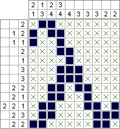

==================
Японский кроссворд
==================

Описание
--------

Изображения зашифрованы числами, расположенными слева от строк, а также сверху над столбцами.
Числа показывают, сколько групп чёрных (либо своего цвета, для цветных кроссвордов)
клеток находятся в соответствующих строке или столбце и сколько слитных клеток содержит
каждая из этих групп (например, набор чисел 4, 1, и 3 означает, что в этом ряду есть три группы:
первая — из четырёх, вторая — из одной, третья — из трёх чёрных клеток).
В чёрно-белом кроссворде группы должны быть разделены, как минимум, одной пустой клеткой,
в цветном это правило касается только одноцветных групп, а разноцветные группы могут быть
расположены вплотную (пустые клетки могут быть и по краям рядов).
Необходимо определить размещение групп клеток.

   Пример решённой головоломки.

Минимальные требования (базовая часть)
--------------------------------------

Базовая реализация проекта, в которой должны разбираться все участники, должна включать:

- интерфейс для разгадывания японского кроссворда;
- загрузку головоломки из файла.

Расширенный интерфейс (дополнительная часть)
--------------------------------------------

Расширенный интерфейс должен добавлять хотя бы 2 различные возможности к базовому интерфейсу.
Ниже перечислены возможные варианты расширения интерфейса, однако этим списком они не ограничены:

- меню выбора головоломок;
- запуск автоматического решателя;
- таймер решения головоломки;
- просмотр таблицы рекордов и архива решенных головоломок;
- интерфейс сохранения/загрузки частичного решения;
- редактор головоломок;
- и т.д.

Генерация и автоматическое решение головоломок (дополнительная часть)
---------------------------------------------------------------------

В этой дополнительной части требуется реализовать генерацию головоломок и автоматический решатель.

Генерация головоломок должна происходить по картинке, заданной в файле
(например, псевдографикой в текстовом файле или в любом медиа-формате).
После генерации головоломки, её сложность должна быть оценена при помощи автоматического решателя.

Автоматическое решение головоломки может быть реализовано несколькими способами. Чтобы использовать тот же алгоритм
для оценки сложности головоломок, необходимо использовать стратегии, моделирующие решение человеком.
При решении на каждом шаге пробуются стратегии, начиная с самой простой, и первая подходящая используется.
Средняя сложность использованных стратегий может расцениваться как общая сложность головоломки.

Выбор из нескольких заранее подготовленных головоломок не считается генерацией.

Работа с базой данных (дополнительная часть)
--------------------------------------------

Модуль для работы с базой данных должен предоставлять хотя бы 2 различных возможности:

- таблица рекордов;
- сохранения игровых сессий;
- база головоломок;
- и т.д.

