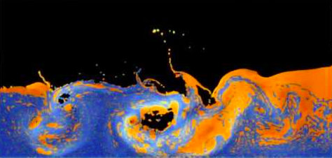

========
Жидкость
========

Описание
--------

Гидродинамика сглаженных частиц (ГСЧ) — это один из распространенных методов
моделирования жидкостей и газов. Он отличается простотой программирования и понимания
процесса в отличие от моделирования на сетке. Этот метод был впервые предложен для
моделирования астрофизических явлений, но сейчас используется также для моделирования
жидкостей, газов и процессов деформации в твердых телах.

   Двухфазное моделирование жидкости.

При моделировании ГСЧ жидкость представляется набором частиц, каждая из которых обладает
набором физических характеристик, как-то: положение :math:`\mathbf{r}_i`, скорость :math:`\mathbf{v}_i`, масса :math:`m_i`. По этим значениям
для частиц восстанавливается значение физических величин во всех точках простанства.
Для частиц определяется длина сглаживания :math:`h`, на расстоянии которой свойства частиц «сглаживаются».

Вклад каждой частицы в значение физической величины в точке :math:`\mathbf{r}` определяется
так называемой функцей ядра :math:`W(\mathbf{r} - \mathbf{r}_i, h)`.
Чаще всего в качестве функции ядра используются Гауссова функция и
полиномиальные сплайны. Значения последних равны нулю для частиц, расположенных дальше,
чем на :math:`h` от точки :math:`\mathbf{r}`. Это позволяет эффективнее расчитывать модель,
игнорируя ничтожно малый вклад далёких частиц.

Любая физическая величина в точке :math:`\mathbf{r}` может быть рассчитана по следующей формуле:

.. math::
   :nowrap:

   A(\mathbf{r}) = \sum_j m_j {A_j \over \rho_j} W (\mathbf{r} - \mathbf{r}_j, h),

где :math:`A_j` — значение величины в точке :math:`\mathbf{r}_j`, :math:`\rho_j` — плотность частиц в точке :math:`\mathbf{r}_j`.
Например, плотность может быть вычислена следующим образом:

.. math::
   :nowrap:

   \rho_\mathbf{r} = \rho(\mathbf{r}) = \sum_j m_j W (\mathbf{r} - \mathbf{r}_j, h).

Для расчёта движения частиц в ГСЧ моделируются силы давления, вязкости и поверхностного натяжения.

Давление для частицы расчитывается исходя из её плотности:

.. math::
   :nowrap:

   p_i = k (\rho_i - \rho_0),

где :math:`\rho_0` — это плотность окружающей среды, а :math:`k` — коэффициент жесткости (сжимаемости). Этот параметр необязателен, но позволяет точнее настроить
систему. Сила давления расчитывается по следующей формуле:

.. math::
   :nowrap:

   f_{pressure}(\mathbf{r}) = \sum_j m_j {p_i + p_j \over 2 \rho_j} \nabla W (\mathbf{r} - \mathbf{r}_j, h)

Вязкость — это эффект, который возникает при «трении» слоёв жидкость друг о друга. Сила вязкости
зависит от скоростей соседних частиц и вычисляется по формуле:

.. math::
   :nowrap:

   f_{viscosity}(\mathbf{r}) = \mu \sum_j m_j {\mathbf{v}_i - \mathbf{v_j} \over \rho_j} \nabla^2 W(\mathbf{r} - \mathbf{r}_j, h),

где :math:`\mu` — коэффициент вязкости.

Сила поверхностного натяжения расчитывается следующим образом:

.. math::
   :nowrap:

   f_{tension}(\mathbf{r}) = \sigma \sum_j m_j {1 \over \rho_j} \nabla^2 W(\mathbf{r} - \mathbf{r}_j, h),

где :math:`\sigma` — коэффициент поверхностного натяжения.

Для различных величин могут использоваться различные функции ядра, наиболее точно описывающие вклад
соседних частиц. Для большинства величин достаточно хорошо подходит функция :math:`W_{poly6}`:

.. math::

   W_{poly6}(\mathbf{r}, h)
   = {315 \over 64 \pi h^9}
   \begin{cases}
     (h^2 - r^2)^3,  & 0 \leq r \leq h \\
     0,              & r > h
   \end{cases}

   \nabla W_{poly6}(\mathbf{r}, h)
   = - {315 \over 64 \pi h^9}
   \begin{cases}
     6 r (h^2 - r^2)^2,  & 0 \leq r \leq h \\
     0,              & r > h
   \end{cases}

   \nabla^2 W_{poly6}(\mathbf{r}, h)
   = {315 \over 64 \pi h^9}
   \begin{cases}
     6 (h^2 - r^2) (4 r^2 - (h^2 - r^2)), & 0 \leq r \leq h \\
     0,                 & r > h
   \end{cases}

Тем не менее, для лучшего эффекта несжимаемой жидкости при расчёте плотности лучше воспользоваться специальной
функцией ядра:

.. math::
   :nowrap:

   W_{density}(\mathbf{r}, h) =
   \begin{cases}
     (1 - {r \over h})^2,  & 0 \leq r \leq h \\
     0,                    & r > h
   \end{cases}

Таким образом, моделирование заключается в пошаговой обработке системы частиц. Каждый шаг включает в себя для
каждой частицы:

- нахождение соседних частиц;
- вычисление плотности;
- вычисление давления;
- расчёт сил: давление, вязкость и поверхностное натяжение;
- добавление гравитации и расчёт ускорения;
- пересчет скорости и положения;
- проверку ограничений (стенки);
- отрисовку.

Минимальные требования (базовая часть)
--------------------------------------

Базовая реализация проекта, в которой должны разбираться все участники, должна содержать:

- визуализацию и моделирование заданной сцены с жидкостью;
- загрузку начального состояния сцены из файла.

Расширенный интерфейс (дополнительная часть)
--------------------------------------------

Расширенный интерфейс должен добавлять хотя бы 2 различные возможности к базовому интерфейсу.
Ниже перечислены возможные варианты расширения интерфейса, однако этим списком они не ограничены:

- меню выбора сцены;
- меню выбора способа моделирования (различные ядровые функции);
- редактор сцены;
- настройки свойств жидкости;
- управление моделированием:
    - пауза/продолжение;
    - ускорение/замедление;
    - перемотка;
- интерфейс сохранения/загрузки текущего состояния сцены;
- отображение поверхности жидкости;
- и т.д.

Расширенные возможности моделирования (дополнительная часть)
------------------------------------------------------------

Расширенное моделирование должно добавлять хотя бы 2 различные возможности к базовому
моделированию жидкости:

- оптимизация расчёта:
    - быстрое нахождение соседних частиц;
    - автоматически подстраиваемая под каждую частицу длина сглаживания (чтобы в
      её окрестности всегда находилось примерно одно и то же кол-во частиц);
- многофазные жидкости (разнородные частицы, вязкость и поверхностное натяжение
  действует только между частицами одного типа);
- взаимодействие с движущимися объектами (мяч, пропеллер и т.п.);
- и т.д.

Работа с базой данных (дополнительная часть)
--------------------------------------------

Модуль для работы с базой данных должен предоставлять хотя бы 2 различных возможности:

- база сцен;
- база жидкостей и других объектов сцены;
- и т.д.

