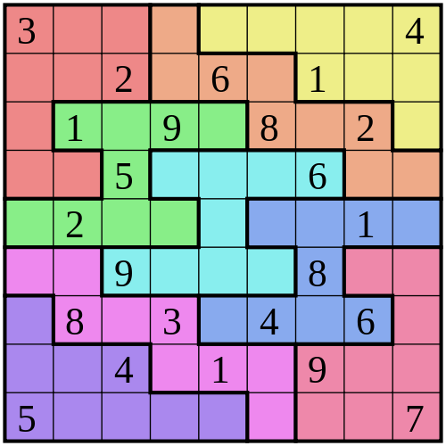

Судоку
--------

Количество участников: 1–3

### Описание

Игровое поле представляет собой квадрат размером 9×9, разделённый на меньшие квадраты со стороной в 3 клетки.
Таким образом, всё игровое поле состоит из 81 клетки.
В них уже в начале игры стоят некоторые числа (от 1 до 9), называемые подсказками.
От игрока требуется заполнить свободные клетки цифрами от 1 до 9 так,
чтобы в каждой строке, в каждом столбце и в каждом малом квадрате 3×3 каждая цифра встречалась бы только один раз.

Сложность судоку зависит не от количества изначально заполненных клеток,
а от методов, которые нужно применять для её решения.
Самые простые решаются дедуктивно: всегда есть хотя бы одна клетка,
куда подходит только одно число.
Некоторые головоломки можно решить за несколько минут, на другие можно потратить часы.

Правильно составленная головоломка имеет только одно решение.

### Минимальные требования (базовая часть)

Базовая реализация проекта, в которой должны разбираться все участники, должна включать:

- интерфейс для разгадывания судоку;
- загрузку головоломки из файла.

### Расширенный интерфейс (дополнительная часть)

Расширенный интерфейс должен добавлять хотя бы 2 различные возможности к базовому интерфейсу.
Ниже перечислены возможные варианты расширения интерфейса, однако этим списком они не ограничены:

- настройки сложности судоку;
- подсказки (например, показать, какие цифры можно поставить в данную клетку);
- запуск автоматического решателя;
- таймер решения головоломки;
- просмотр таблицы рекордов;
- интерфейс сохранения/загрузки игр;
- выбор разновидности головоломки;
- редактор головоломок;
- и т.д.

### Генерация и автоматическое решение головоломок (дополнительная часть)

В этой дополнительной части требуется реализовать генерацию головоломок с заданной сложностью и автоматический решатель.

Простым способом генерации головоломки «Судоку» является случайная перестановка строк и стобцов и
вычёркивание случайных клеток. Для генерации головоломок заданной сложности можно воспользоваться
одним из двух вариантов:

- вычёркивать клетки по одной, каждый раз оценивая насколько игра усложняется
  (насколько трудно человеку будет проставить вычеркнутую цифру);
- генерировать головоломку, используя автоматический решатель.

Автоматическое решение головоломки может быть реализовано несколькими способами. Чтобы использовать тот же алгоритм
для генерации головоломок заданной сложности, необходимо использовать стратегии, моделирующие решение человеком:

- при решении на каждом шаге пробуются стратегии, начиная с самой простой, и первая подходящая используется.
- при генерации на каждом шаге добавляется очередная цифра в поле, на основе одной из стратегий заданной сложности.

Выбор из нескольких заранее подготовленных головоломок не считается генерацией.

### Работа с базой данных (дополнительная часть)

Модуль для работы с базой данных должен предоставлять хотя бы 2 различных возможности:

- таблица рекордов;
- сохранения игровых сессий;
- база головоломок;
- и т.д.

