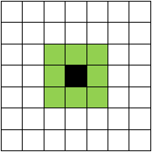

Игра «Жизнь»
------------

### Описание

Игра «Жизнь» — это клеточный автомат, придуманный английским математиком Джоном Конвеем в 1970 году.

Игра происходит во вселенной — плоскости или поверхности, разбитой на клетки. Каждая клетка в каждый момент времени
может находиться в одном из двух состояний: быть «живой» или «мёртвой» (пустой). У каждой клетки есть соседи,
определяемые окрестностью Мура.

Время в игре разбито на шаги, за каждый шаг все клетки одновременно обновляют своё состояние по следующим правилам:

- в пустой (мёртвой) клетке зарождается жизнь, если рядом находится ровно 3 живые клетки;
- если у живой клетки ровно 2 или 3 живых соседа, она остаётся жить; иначе она умирает (от одиночества или перенаселённости).

Игрок не принимает прямого участия в игре, а лишь расставляет или генерирует начальную конфигурацию живых клеток,
которые затем взаимодействуют согласно правилам уже без его участия (он является наблюдателем).

В игре жизнь присутсвует множество интересных структур. Самым популярным, вероятно, является планер.

### Минимальные требования к реализации

Базовая реализация проекта, в которой должны разбираться все участники, должна содержать:

- визуализацию и моделирование заданной сцены;
- загрузку начального состояния сцены из файла.

### Расширенный интерфейс (дополнительная часть)

Расширенный интерфейс должен добавлять хотя бы 2 различные возможности к базовому интерфейсу.
Ниже перечислены возможные варианты расширения интерфейса, однако этим списком они не ограничены:

- меню выбора сцены;
- меню выбора модификаций игры «Жизнь»;
- настройки поля-вселенной;
- редактор сцены с панелью заготовленных объектов;
- управление моделированием:
    - пауза/продолжение;
    - ускорение/замедление;
    - перемотка;
- интерфейс сохранения/загрузки;
- и т.д.

### Расширенные возможности моделирования (дополнительная часть)

Расширенное моделирование должно добавлять хотя бы 2 различные возможности к базовому
моделированию жидкости:

- оптимизация расчёта: быстрое нахождение соседних частиц и расчёт только окрестностей живых клеток;
- модификации игры жизнь:
    - полноцветная игра;
    - шестиугольная сетка;
- и т.д.

### Работа с базой данных (дополнительная часть)

Модуль для работы с базой данных должен предоставлять хотя бы 2 различных возможности:

- база сцен;
- база объектов;
- и т.д.

